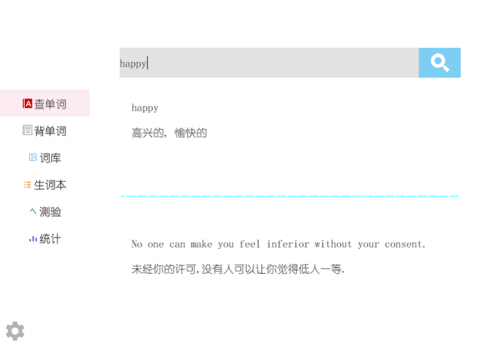
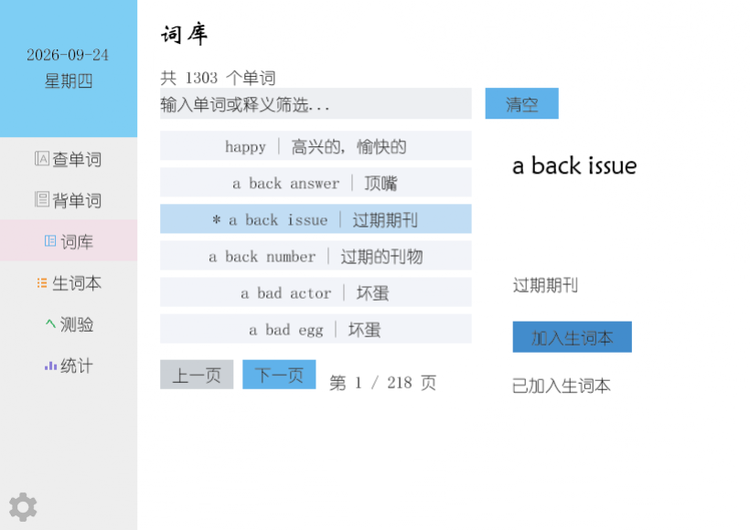

# 背单词软件 (Dictionary)

* 使用语言:Java
* 编码格式用:UTF-8
* IDE:IDEA
* 项目管理工具:Gradle (ps:也就是用libgdx框架)
* 仿照有道写的豆腐渣,用的有道的icon

#### **开始日期:2018-12-3号**
1. 2018-12-3号 创建框架,测试下git -- Zzzxb
2. 2018-12-6号 增加选项，睡醒明天再写，好好摸索下。 -- Zzzxb
3. 2018-12-7号 重写选项栏 -- Zzzxb
4. 2018-12-8号 选项卡完成，接下来选项卡显示内容 -- Zzzxb
5. 2018-12-9号 查单词功能基本ok，剩下背单词和设置选项了。晚安! -- Zzzxb
6. 2018-12-9号 背单词功能差不多了，明天设置界面，后天稍微重构一下. -- Zzzxb
7. 2018-12-11号 采用libgdx写个界面真闹心,mybatis找不到路径,用JDBC吧. -- Zzzxb
8. 2018-12-12好 Gradle路径问题已经修复，继续使用MyBatis，是真滴麻烦。--Sdh
9. 2018-12-13号 采用json能查找1000多个单词了，显示7天的每日一句,等有时间了再改吧 -- Zzzxb
10. 2018-12-13号 忘了更新项目了写完后更新的过,只有read文件合并了一下，其它东西东西完美丢失，没办法只能重写一遍了.更改仓库传到我fork的仓库了，
mybatis在我电脑上用不成,我也打不开项目，等需要的时候我提交下分支就行了. -- Zzzxb
11. 2018-12-13号 用Json查单词整好了,用Json的话找到我fork你的仓库下载下来我就不提交了，话把词库更新了就能用了，背单词的话仿照着WordJson文件和character.json文件再写一个添加进去替换了下optionTwoPage类中的WordJson名字就能用了。界面哪里不行的话等3月份我再改改,现在这个只用更新词库就行了。 -- Zzzxb
#### **不完整Demo结束日期:2018-12-13号** -- Zzzxb

* 初次用libgdx写东西不知道该怎么写单词软件，本来想从数据库中查找的可是路径总是不对。
所以这个就算做1.0版本吧。等学到足够的知识或应对方法了再好好写东西，不然东拼西凑的，
跟豆腐渣工程一样，一戳就塌方了。以前学的东西没弄明白，现在回来重新自学一遍吧，
把没学会没弄懂的再学学，学会的再沉淀一下。 -- Zzzxb

当年(2018)那版的界面(图在上游仓库里, 那时候还是 32 位 dylib 才能跑的老版本):


---

#### **2026-09-24 修复: 让它在 M 系列芯片的 Mac 上重新跑起来** -- Zzzxb

换电脑之后一直报这个错:

```
java.lang.UnsatisfiedLinkError: Can't load library: .../T/libgdxzzzxb/a4fe9f6c/libgdx.dylib
```

原因是 libGDX 1.9.8 自带的 macOS 原生库是 **32 位 i386** 的(用 `lipo -info` 一看就知道),
现在的 macOS 加上 Apple Silicon 早就完全不支持 32 位了, 所以这个 dylib 怎么都加载不进去,
跟代码一点关系都没有。要动的地方:

1. libGDX `1.9.8` -> `1.14.1`, 后端从 `gdx-backend-lwjgl`(LWJGL 2, 根本没有 arm64 原生库)
   换成 `gdx-backend-lwjgl3`(里面自带 `lwjgl natives-macos-arm64`)
2. Gradle `4.6` -> `8.10`; `compile` -> `implementation`; 编译目标用 Java 8(和 libGDX 自身的字节码
   一致, 这样 IDEA 里项目 SDK 是 1.8 还是终端默认的 21 都不会再报 "无效的源发行版")
3. `DesktopLauncher` 改成 `Lwjgl3Application` + `Lwjgl3ApplicationConfiguration`
4. macOS 上 GLFW 必须跑在进程的第一个线程, 运行时要带 `-XstartOnFirstThread`
   (Gradle 的 run/debug 任务里已经按系统自动加上了)

怎么运行:

```bash
./gradlew :desktop:run     # 直接运行
./gradlew :desktop:debug   # 调试运行, 再连 localhost:5005
./gradlew :desktop:dist    # 打包成 desktop/build/libs/Dictionary-1.0.jar
java -XstartOnFirstThread -jar desktop/build/libs/Dictionary-1.0.jar   # macOS 上跑 jar 也得带这个参数
```

> 在 IDEA 里直接点 `DesktopLauncher` 那个绿三角运行的话, 要在 Run Configuration 的
> VM options 里填上 `-XstartOnFirstThread`, 不然会报 `GLFW may only be used on the main thread`。
> 顺便建议把 IDEA 的 Project SDK 和 Gradle JVM 都设成 21。 -- Zzzxb

---

#### **2026-09-24 新功能: 词库 / 生词本 / 单词测验 / 学习统计** -- Zzzxb

原来左边的菜单只有"查单词"和"背单词"两个, 3-6 号按钮是空的占位。这次把空页面填上了,
菜单现在是 6 个页面 + 设置, 顺手把之前没接上的数据(character.json 里的 1300 个词条、
生词本、学习记录)串起来了。

1. **词库**(3 号按钮): 把 `core/assets/character.json` 里的一千多个词条全列出来,
   支持输入单词或中文释义实时筛选、上一页/下一页翻页, 点一行右边会显示完整释义,
   看中的词可以一键"加入生词本"。已经在生词本里的词前面会带一个 `*`。
2. **生词本**(4 号按钮): 背单词页点"不认识"、词库页点"加入生词本"都会记到这里,
   可以逐条"移除", 也支持翻页。
3. **单词测验**(5 号按钮): 从词库里随机抽词做四选一(选项是从别的词条里随机取的释义),
   答完给对错反馈并把正确选项标绿, 一轮结束显示得分和正确率。每轮题数在设置里调,
   开了"答对后自动下一题"的话答完停 1.2 秒会自动跳到下一题。
4. **学习统计**(6 号按钮): 今日进度(带进度条)/ 累计复习 / 认识与不认识的比例 /
   掌握率 / 测验正确率 / 连续打卡和最长连续 / 学习天数 / 生词本数量 / 词库总量。
   统计页和设置页都有一个两步确认的"重置"(第一下问你要不要清, 5 秒内再点一下才真的清)。
5. **设置**(左下角齿轮): 每天背单词数的目标(5-200)、每轮测验题数(5-50)、
   答对后自动下一题开关、重置全部数据。
6. **查单词 / 背单词也接上了真词库**(原来这两页的数据是写死的):
   - 查单词页原来是 4 个 if-else 硬编码(只认 happy/memory 和两个同学的名字), 而且
     `if (text != null || text != "")` 这个条件永远为真。现在改成真查 `character.json`:
     精确匹配(忽略大小写)就给完整释义, 查不到会给"你是不是想找"(先按包含匹配,
     再按编辑距离猜拼写错误, 比如 happpy -> happy), 都没有才提示换个拼写。
   - 背单词页原来写死 3 个单词("Memory/Happy/Duang", 其中 memory 和 duang 词库里根本没有),
     现在按设置里的"每日目标"从词库里抽一批词, 用当天日期当随机种子, 所以同一天抽到的
     永远是同一批、重启后进度条还对得上; 释义太长的词不会进卡片(按宽度折行 + 截断)。

现在的样子(查单词 / 词库):




数据放在哪: 都用 libGDX 的 `Preferences` 存在本地(桌面端是用户目录下的 `.prefs/dictionary-study`),
JSON 格式, 不开数据库也能记住生词本和学习记录, 重启软件数据还在。

这次新增的代码(老代码基本没动, 只加了几行接线):

```
core/src/com/mini/dictionary/
├── util/FontCache.java      字体缓存, 一种字体全局只加载一次(2048x2048 的图集很吃显存)
├── util/TextUtil.java       截断/压空白/百分比这些小工具
├── util/WordBank.java       解析 character.json, 提供全部词条/筛选/随机抽词
├── util/StudyData.java      设置 + 生词本 + 学习统计, 存 Preferences
├── ui/UiKit.java            代码生成按钮底色/小图标/输入框, 不用加新图片资源
└── ui/layout/page/
    ├── OptionThreePage.java 词库
    ├── OptionFourPage.java  生词本
    ├── OptionFivePage.java  单词测验
    ├── OptionSixPage.java   学习统计
    └── OptionSettingPage.java 设置
```

> 注意: 项目里的位图字体(font18/myfont)没有全角标点(，。：)和 —★→ 这类符号,
> 界面上的文字统一用半角标点, 否则会显示不出来(有需要的话得重新生成字体图集)。
> 另外原来菜单按钮用的 `default.fnt` 只带了"查单词/背单词"几个字的字形, 新菜单项会显示空白,
> 所以菜单字体换成了 `font18`。 -- Zzzxb

使用 deepseek 更新了一下当年写的软件，当时就照着官网的例子写了他们文档中的接雨滴游戏后就开始用这个写软件，当时对这些东西都不了解，纯粹就是想怎么用怎么用，想怎么写怎么写，现在也是😂.不过时间过的真快.